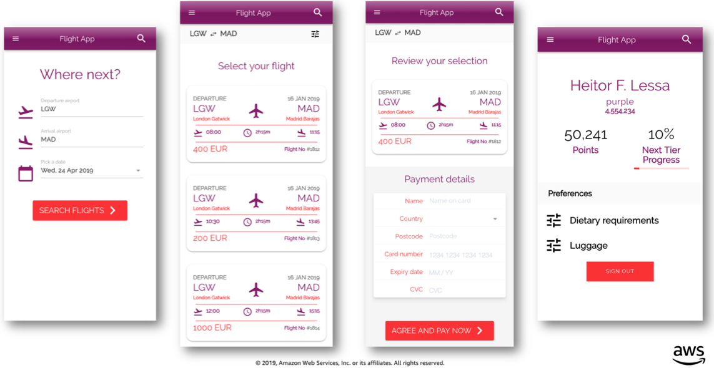
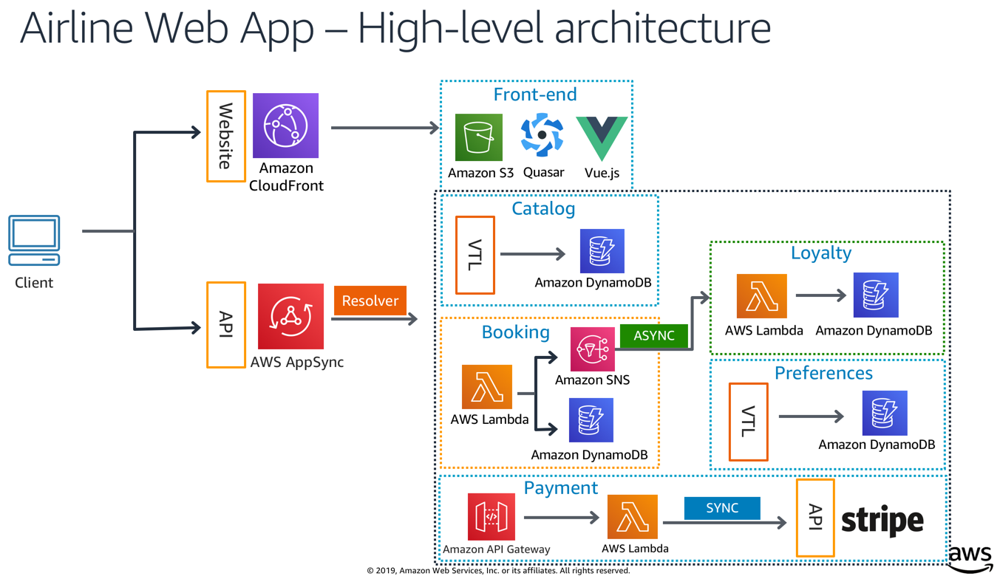

## AWS Serverless Airline Booking

Airline Booking is a complete web application that provides Flight Search, Flight Payment, Flight Booking, Flight Preferences and Loyalty points including end-to-end testing, GraphQL and CI/CD. This web application is the theme of [Build on Serverless Season 2 on AWS Twitch running from April 24th until August 7th](https://pages.awscloud.com/GLOBAL-devstrategy-OE-BuildOnServerless-2019-reg-event.html).

    

## FAQ

**Q: Will the README be updated with more info?**

Yes! We'll make incremental changes as the series progress.

**Q: When will the full code be available?**

Full code will be available by end of August - We will have a bonus episode, and we want to make sure a proper PR is reviewed before merging including docs for whatever is decided ;)

**Q: Will episodes be recorded?**

Yes! You can find them in the main link above - Chat transcription will not be recorded.

**Q: What are you using for the front-end?**

## License Summary

This sample code is made available under the MIT-0 license. See the LICENSE file.
