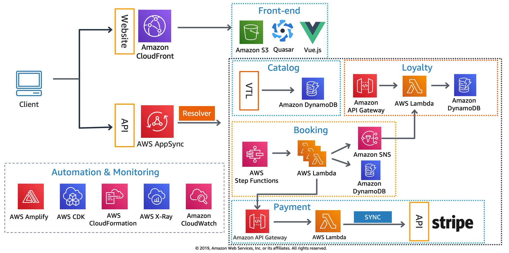

## AWS Serverless Airline Booking

**STATUS**: Work-in-progress, ETA re:Invent 2019

Serverless Airline Booking is a complete web application that provides Flight Search, Payment, Booking and Loyalty points including end-to-end testing, GraphQL and CI/CD. This web application was the theme of [Build on Serverless Season 2 on AWS Twitch running from April 24th until August 7th](https://pages.awscloud.com/GLOBAL-devstrategy-OE-BuildOnServerless-2019-reg-event.html).

For more up-to-date information on what's being implemented, take a look at our current [Boards](https://github.com/aws-samples/aws-serverless-airline-booking/projects).

## Deployment

To get started with the Serverless Airline application, you can deploy into your AWS Account by following our [Get Started instructions](./docs/getting_started.md)

## Stack

Summary of what the stack looks like now including a picture with the core tech:

* **Front-end** - Vue.js as the core framework, Quasar for UI, Amplify for Auth UI component and AWS integration, and Stripe JS with Stripe Elements for card tokenization, validation, etc.
* **Data** - All data is modeled after GraphQL types and stored in DynamoDB. Python being the core language for all services except Loyalty that's written in Typescript, and JavaScript for front-end.
* **API** - GraphQL is managed by AppSync and also acts as an API Hub to interact with other services. Loyalty implements a REST API to demonstrate how to secure service-to-service communication while maintaining a public endpoint. Payment API is also based on REST to demonstrate an external payment provider.
* **Auth** - Cognito provides JSON Web Tokens (JWT) and along with AppSync fine-grained authorization on what data types users can access.
* **Messaging** - Booking workflow is managed by Step Functions while SNS provides service-to-service communication through messaging between Booking and Loyalty.

### Back-end

Back-end services that makes up the Serverless Airline functionalities as of now:

Service | Language | Description
------------------------------------------------- | ------------------------------------------------- | ---------------------------------------------------------------------------------
Catalog | Apache VTL | Provides Flight search. CRUD operations including custom indexes are auto-generated by Amplify
Booking | Python and Apache VTL | Provides new and list Bookings. CRUD operations including custom indexes are auto-generated by Amplify. Business workflow is implemented in Python.
Payment | YAML and Python | Provides payment authorization, collection and refund. Bulk of Payment integration with Stripe is done via a [Serverless Application Repository App](https://serverlessrepo.aws.amazon.com/applications/arn:aws:serverlessrepo:us-east-1:375983427419:applications~api-lambda-stripe-charge). Payment collection and refund operations within Booking business workflow are in Python
Loyalty | Typescript | Provides Loyalty points for customers including tiers. Fetching and ingesting Loyalty points are implemented in Typescript.

**High level infrastructure architecture**

## License Summary

This sample code is made available under the MIT-0 license. See the LICENSE file.
