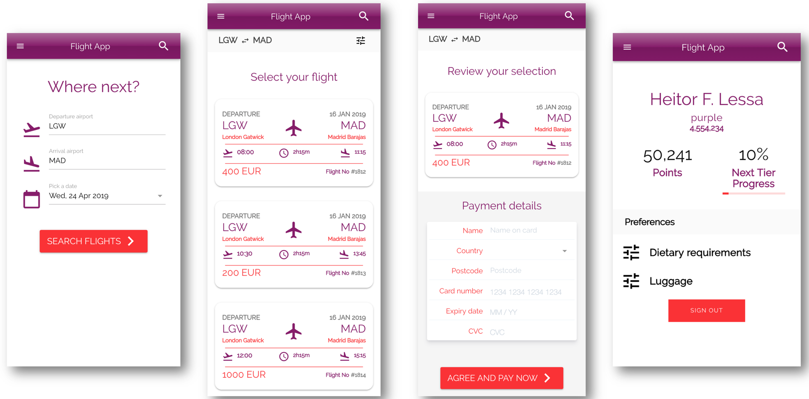

## AWS Serverless Airline Booking

**STATUS**: Work-in-progress, ETA re:Invent 2019

Serverless Airline Booking is a complete web application that provides Flight Search, Payment, Booking and Loyalty points including end-to-end testing, GraphQL and CI/CD. This web application was the theme of [Build on Serverless Season 2 on AWS Twitch running from April 24th until August 7th](https://pages.awscloud.com/GLOBAL-devstrategy-OE-BuildOnServerless-2019-reg-event.html).

## Stack

* **Front-end** - Vue.js as the core framework, Quasar for UI, Amplify for Auth UI component and AWS integration, and Stripe JS with Stripe Elements for card tokenization, validation, etc.
* **Data** - All data is modeled after GraphQL types and stored in DynamoDB. Python being the core language for all services except Loyalty that's written in Typescript, and JavaScript for front-end.
* **API** - GraphQL is managed by AppSync and also acts as an API Hub to interact with other services. Loyalty implements a REST API to demonstrate how to secure service-to-service communication while maintaining a public endpoint. Payment API is also based on REST to demonstrate an external payment provider.
* **Auth** - Cognito provides JSON Web Tokens (JWT) and along with AppSync fine-grained authorization on what data types users can access.
* **Messaging** - Booking workflow is managed by Step Functions while SNS provides service-to-service communication through messaging between Booking and Loyalty.

These are the current back-end services that makes up the Serverless Airline functionalities:

Service | Language | Description
------------------------------------------------- | ------------------------------------------------- | ---------------------------------------------------------------------------------
Catalog | Apache VTL | Provides Flight search. CRUD operations including custom indexes are auto-generated by Amplify
Booking | Python and Apache VTL | Provides new and list Bookings. CRUD operations including custom indexes are auto-generated by Amplify. Business workflow is implemented in Python.
Payment | YAML and Python | Provides payment authorization, collection and refund. Bulk of Payment integration with Stripe is done via a [Serverless Application Repository App](https://serverlessrepo.aws.amazon.com/applications/arn:aws:serverlessrepo:us-east-1:375983427419:applications~api-lambda-stripe-charge). Payment collection and refund operations within Booking business workflow are in Python
Loyalty | Typescript | Provides Loyalty points for customers including tiers. Fetching and ingesting Loyalty points are implemented in Typescript.

## Deployment instructions

### Requirements

Before you deploy, you must have the following in place:

* [AWS Account](https://aws.amazon.com/account/)
* [Python 3.7 or greater](https://realpython.com/installing-python/)
* [Node 8.10 or greater](https://nodejs.org/en/download/)
* [Amplify CLI 3.17.0 or greater installed and configured](https://aws-amplify.github.io/docs/cli-toolchain/quickstart#quickstart)
* [SAM CLI](https://docs.aws.amazon.com/serverless-application-model/latest/developerguide/serverless-sam-cli-install.html)
* [Docker](https://docs.docker.com/install/)
* [Stripe Account](https://dashboard.stripe.com/register)
    - Take note of your testing `Secret Key` and `Public Key` [located in the Stripe Dashboard](https://support.stripe.com/questions/locate-api-keys)

### Howto

**NOTICE**: AWS AppSync is not part of [Free tier](https://aws.amazon.com/free) and some AWS services used may not be covered by the [Free tier](https://aws.amazon.com/free) after 12 months.

1) Fork this project and take note of the url
2) Within an empty directory, initialize the project with **``amplify init --app <fork-github-url>``**
3) Choose to create a new environment (i.e. dev)
4) Verify that you now have at least `Auth` and `Api` categories by running **`amplify status`**
5) Deploy amplify managed infrastructure by running **`amplify push`**
6) Once complete, open [AWS Amplify Console](https://console.aws.amazon.com/amplify/home)
    - If this is your first time using Amplify Console, select **`Deploy`**
7) Click on `Connect app`, select `GitHub`, choose your Fork repo and select the branch **`develop`**
8) Under "Existing Amplify backend detected", **select your new environment** created in Step 2
9) Choose an existing Amplify Console IAM Role or create a new one

At the end of the first deployment, you should have a new URL where you can visit and sign the first user up - Next steps being setup payment and add flights.

> **NOTE**: We're currently working on an ETL feature to automatically add flights as part of CI.

#### Setting up Stripe integration

**Public key for tokenizing card data during flight booking**

1. Within your fork, open front-end environment variable file **`src/frontend/.env`**
2. Update the value of **`VUE_APP_StripePublicKey`** with your Stripe public key

**Secret key for collecting pre-authorized charges**

1. Within [AWS Amplify Console](https://console.aws.amazon.com/amplify/home), select your App and expand ``Environment Variables``
2. Add **`STRIPE_SECRET_KEY`** environment variable and its value

#### Adding your first flight

Provided you have followed deployment instructions and signed up your first user, take the steps below to log in to AWS AppSync and run a `createFlight` mutation:

1. Open Amplify variable file **`src/frontend/aws-exports.js`** and take note of **`aws_user_pools_web_client_id`**
2. Go to the [AWS AppSync Console](https://console.aws.amazon.com/appsync/home), and select the `Serverless Airline API`
3. Go to `Queries` on the left menu, and select `Login with User Pools`
4. Within `ClientId` use the value you took note in `Step 1`, and use the credentials of your newly created Cognito user
5. Within your fork, copy any of the `createFlight` mutations provided in **`sample-queries-mutations.gql`**
6. Open up the front-end, and search for a flight from **`LGW`** to **`MAD`** for **December 2nd, 2019**

---

## FAQ

**Q: Will the README be updated with more info?**

Yes! We'll make incremental changes as the series progress.

**Q: When will the full code be available?**

ETA is for re:Invent 2019. We've decided to spend more time polishing utility libraries, and bake more best practices. Expectation to call it complete will be when the following is fully implemented:

* [ ] Full suite of tests
* [ ] Migrate to Quasar 1.0 (now GA)
* [ ] Python and JS utility library for tracing, structured logging and async custom metrics
* [ ] Detailed README for each folder
* [ ] ETL to hydrate flights
* [ ] Major performance optimizations merged
* [ ] Performance Load test scenarios

**Q: Will episodes be recorded?**

Yes! You can find them in the [Landing Page]([Build on Serverless Season 2 on AWS Twitch running from April 24th until August 7th](https://pages.awscloud.com/GLOBAL-devstrategy-OE-BuildOnServerless-2019-reg-event.html) or as a [Twitch Collection](https://www.twitch.tv/collections/2s5GEfNTuRXCeg)

**Q: What are you using for the front-end?**

**Q: What is the high level infra architecture?**

## License Summary

This sample code is made available under the MIT-0 license. See the LICENSE file.
