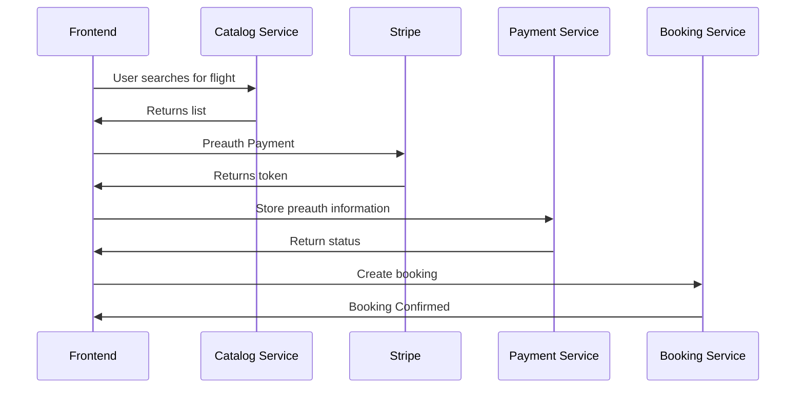

# Booking Service

> **Warning**
> Please do not enter any credit card information into this project other than one of the [Stripe test cards](https://stripe.com/docs/testing#cards)

## User Stories
- “As a customer, I want to be able to book a flight for today or at a particular date”
- “As a customer, I want to be able to see only my bookings”
- "As a customer, I want to pay only if my booking is confirmed"

### Diagram
Defined actions for the frontend. Services offer a private API for inter-service communication.


## Payment integration
As you confirm a booking, you can use the payment token to collect payment by calling the Payment API. You have to work with Payment to define what this API will look like and what authorization means you'll need to collect payments.

## Front-end integration

### Retrieving Bookings
Front-end expects booking data to be in the following format:

```json
[
	{
		"id": "A1",
		"status": "CONFIRMED",
		"bookingReference": "Flkuc1",
		"departureCity": "London",
		"createdAt": "2019-01-01T08:00+0000",
		"outboundFlight": {
			"id": "173ec46b-0e12-45fe-9ba1-511abde3d318",
			"departureDate": "2019-01-16T08:00+0000",
			"departureAirportCode": "LGW",
			"departureAirportName": "London Gatwick",
			"departureCity": "London",
			"departureLocale": "Europe/London",
			"arrivalDate": "2019-01-16T10:15+0000",
			"arrivalAirportCode": "MAD",
			"arrivalAirportName": "Madrid Barajas",
			"arrivalCity": "Madrid",
			"arrivalLocale": "Europe/Madrid",
			"ticketPrice": 400,
			"ticketCurrency": "EUR",
			"flightNumber": 1812
		}
	}
]
```
> **Tip**
> You may need to call Catalog service to have full flight details.

### Creating Bookings
Front-end sends the following payload when trying to create a booking:
```json
{
	"chargeToken": "pre-authorization-payment-token",
	"outboundFlight": "outbound-flight-id"
}
```

If booking is successful, Front-end expects the following response:
```json
{
	"bookingId": "booking-unique-id"
}
```
> **Tip**
> Booking could communicate a successful transaction to Loyalty service to compute customer's points asynchronously.

## Initial OpenAPI
```yaml
openapi: 3.0.3
info:
  title: Bookings API
  description: |-
    Bookings service
  externalDocs:
    description: GitHub Repository
    url: https://github.com/aws-samples/aws-serverless-airline-booking/tree/workshop
paths:
  /bookings:
    put:
      summary: Create a new booking
      description: Create a new booking
      requestBody:
        content:
          application/json:
            schema:
              type: object
              properties:
                chargeToken:
                  example: abc123
                  type: string
                  description: Stripe pre-auth token
                outboundFlight:
                  example: 173ec46b-0e12-45fe-9ba1-511abde3d318
                  type: string
                  description: Flight ID
      responses:
        '200':
          description: Successful operation
          content:
            application/json:
              schema:
                type: object
                properties:
                  bookingId:
                    example: abc123
                    type: string
                    description: Booking ID
      security:
        - users:
            - write:bookings
            - read:bookings
    get:
      summary: Get list of flights
      description: Get list of flights
      responses:
        '200':
          description: Successful operation
          content:
            application/json:
              schema:
                $ref: '#/components/schemas/Booking'
      security:
        - users:
            - write:bookings
            - read:bookings

components:
  schemas:
    Flight:
      type: object
      properties:
        id:
          example: 173ec46b-0e12-45fe-9ba1-511abde3d318
          type: string
        departureDate:
          example: 2019-01-16T08:00+0000
          type: string
          format: date-time
        departureAirportCode:
          example: LGW
          type: string
        departureAirportName:
          example: London Gatwick
          type: string
        departureCity:
          example: London
          type: string
        departureLocale:
          example: Europe/London
          type: string
        arrivalDate:
          example: 2019-01-16T10:15+0000
          type: string
          format: date-time
        arrivalAirportName:
          example: Madrid Barajas
          type: string
        arrivalCity:
          example: Madrid
          type: string
        arrivalLocale:
          example: Europe/Madrid
          type: string
        ticketPrice:
          example: 400
          type: number
          format: float
        ticketCurrency:
          example: EUR
          type: string
        flightNumber:
          example: 1812
          type: string

    Booking:
      type: object
      properties:
        id:
          example: A1
          type: string
        status:
          example: CONFIRMED
          type: string
        bookingReference:
          example: Flkuc1
          type: string
        departureCity:
          example: London
          type: string
        createdAt:
          example: 2019-01-01T08:00+0000
          type: string
          format: date-time
        flight:
          $ref: '#/components/schemas/Flight'

  securitySchemes:
    users:
      type: oauth2
      flows:
        implicit:
          authorizationUrl: https://petstore3.swagger.io/oauth/authorize
          scopes:
            write:bookings:
            read:bookings:
```
