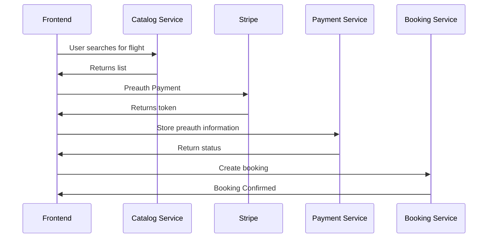

# Catalog Service

> **Warning**
> Please do not enter any credit card information into this project other than one of the [Stripe test cards](https://stripe.com/docs/testing#cards)

## User Stories
- "As a customer, I want to get a list of flights for a destination"
- "As a customer, I want to fetch a flight by its unique ID"
- "As a customer, I only want to see flights where there are seats available"

### Diagram
Defined actions for the frontend. Services offer a private API for inter-service communication.


## Booking integration
Booking may need to call Catalog to verify flight exists before making a booking. You have to work together to ensure:
- Flight exists and can be retrieved later by ID
- Flight is not overbooked if it runs out of seat capacity

## Frontend integration
Customers search using departure date (YYYY-MM-DD), departure airport (LGW) and arrival airport (MAD). If flights have been successfully found, it expects the response in the following format:
```json
[
  {
    "id": "173ec46b-0e12-45fe-9ba1-511abde3d318",
    "departureDate": "2019-01-16T08:00+0000",
    "departureAirportCode": "LGW",
    "departureAirportName": "London Gatwick",
    "departureCity": "London",
    "departureLocale": "Europe/London",
    "arrivalDate": "2019-01-16T10:15+0000",
    "arrivalAirportCode": "MAD",
    "arrivalAirportName": "Madrid Barajas",
    "arrivalCity": "Madrid",
    "arrivalLocale": "Europe/Madrid",
    "ticketPrice": 400,
    "ticketCurrency": "EUR",
    "flightNumber": 1812
  }
]
```

When returning a single flight, the expected response format is:
Customers search using departure date (YYYY-MM-DD), departure airport (LGW) and arrival airport (MAD). If flights have been successfully found, it expects the response in the following format:
```json
  {
      "id": "173ec46b-0e12-45fe-9ba1-511abde3d318",
      "departureDate": "2019-01-16T08:00+0000",
      "departureAirportCode": "LGW",
      "departureAirportName": "London Gatwick",
      "departureCity": "London",
      "departureLocale": "Europe/London",
      "arrivalDate": "2019-01-16T10:15+0000",
      "arrivalAirportCode": "MAD",
      "arrivalAirportName": "Madrid Barajas",
      "arrivalCity": "Madrid",
      "arrivalLocale": "Europe/Madrid",
      "ticketPrice": 400,
      "ticketCurrency": "EUR",
      "flightNumber": 1812
  }
```

### Initial OpenAPI
```yaml
openapi: 3.0.3
info:
  title: Catalog API
  description: |-
    Catalog service
  externalDocs:
    description: GitHub Repository
    url: https://github.com/aws-samples/aws-serverless-airline-booking/tree/workshop
paths:
  /flights:
    get:
      summary: Get list of flights
      description: Get list of flights
      responses:
        '200':
          description: Successful operation
          content:
            application/json:
              schema:
                type: array
                items:
                  $ref: '#/components/schemas/Flight'
      security:
        - users:
            - write:catalog
            - read:catalog
  /flights/{flightId}:
    get:
      summary: Get a single flight
      description: Get a single flight
      parameters:
        - name: flightId
          in: path
          description: ID of flight to return
          required: true
          schema:
            type: string
      responses:
        '200':
          description: Successful operation
          content:
            application/json:
              schema:
                $ref: '#/components/schemas/Flight'
      security:
        - users:
            - write:catalog
            - read:catalog
components:
  schemas:
    Flight:
      type: object
      properties:
        id:
          example: 173ec46b-0e12-45fe-9ba1-511abde3d318
          type: string
        departureDate:
          example: 2019-01-16T08:00+0000
          type: string
          format: date-time
        departureAirportCode:
          example: LGW
          type: string
        departureAirportName:
          example: London Gatwick
          type: string
        departureCity:
          example: London
          type: string
        departureLocale:
          example: Europe/London
          type: string
        arrivalDate:
          example: 2019-01-16T10:15+0000
          type: string
          format: date-time
        arrivalAirportName:
          example: Madrid Barajas
          type: string
        arrivalCity:
          example: Madrid
          type: string
        arrivalLocale:
          example: Europe/Madrid
          type: string
        ticketPrice:
          example: 400
          type: number
          format: float
        ticketCurrency:
          example: EUR
          type: string
        flightNumber:
          example: 1812
          type: string

  securitySchemes:
    users:
      type: oauth2
      flows:
        implicit:
          authorizationUrl: https://petstore3.swagger.io/oauth/authorize
          scopes:
            write:catalog:
            read:catalog:
```
