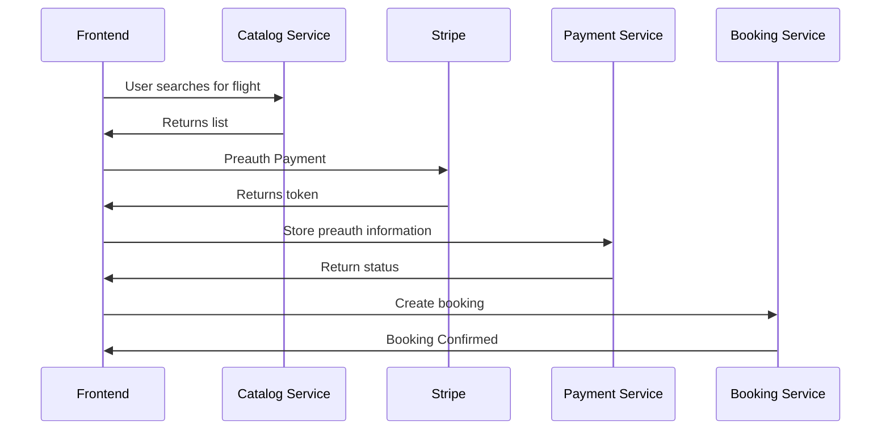

# Loyalty Service

> **Warning**
> Please do not enter any credit card information into this project other than one of the [Stripe test cards](https://stripe.com/docs/testing#cards)

## User Stories
- "As a customer, I want to earn loyalty points upon successful bookings"
- "As a customer, I would like to know how far I am to the next tier"

### Diagram
Defined actions for the frontend. Services offer a private API for inter-service communication.


## Booking integration
Once a booking has been confirmed, you have to agree with booking what data you need to calculate points for customers, and how they should communicate this over to you.

## Frontend integration
Front-end should only receive loyalty information for the current authorized user. As regards to the response, it expects the data in the following format:
```json
{
      "points": 400,
      "level": "bronze",
      "remainingPoints":49600
}
```

### Initial OpenAPI
```yaml
openapi: 3.0.3
info:
  title: Loyalty API
  description: |-
    Payment service
externalDocs:
  description: GitHub Repository
  url: https://github.com/aws-samples/aws-serverless-airline-booking/tree/workshop
paths:
  /status:
    get:
      summary: Get the status and points of a customer
      description: Get the status and points of a customer
      responses:
        '200':
          description: Successful operation
          content:
            application/json:
              schema:
                $ref: '#/components/schemas/LoyaltyData'
      security:
        - users:
            - write:loyalty
            - read:loyalty
components:
  schemas:
    LoyaltyData:
      type: object
      properties:
        points:
          example: 100
          format: int64
          type: number
          description: Amount of points
        level:
          example: Gold
          type: string
          description: Current membership level
        remainingPoints:
          example: 100000
          type: number
          format: int64
          description: Amount of points required for the next level

  securitySchemes:
    users:
      type: oauth2
      flows:
        implicit:
          authorizationUrl: https://petstore3.swagger.io/oauth/authorize
          scopes:
            write:loyalty:
            read:loyalty:
```
