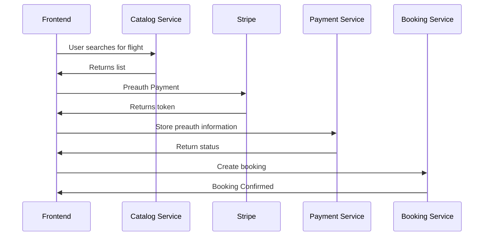

# Payments Service

> !! Warning
> Please do not enter any credit card information into this project other than one of the [Stripe test cards](https://stripe.com/docs/testing#cards)

## User Stories
- "As a customer, I want to be charged a pre-authorization for my flight not the full amount"
- "As a customer, I'd like to pay for the full amount once my booking is confirmed"

### Diagram
Defined actions for the frontend. Services offer a private API for inter-service communication.

## Info

> **Note**
> This project integrates with Stripe, an access key and secret key are required and can be provided. Alternatively, you can create an account  and produce your own _**test**_ keys.

The frontend will [pre-authorise](https://stripe.com/docs/payments/place-a-hold-on-a-payment-method) the credit card for you. After it's performed the pre-authorization, the frontend will call the payments servie to notify it about the transaction.

Whilst performing the booking, the booking service will notify the payment service to complete the transaction.
