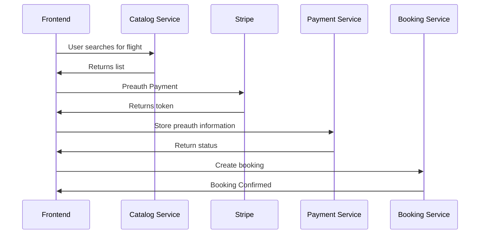

# Payments Service

> **Warning**
> Please do not enter any credit card information into this project other than one of the [Stripe test cards](https://stripe.com/docs/testing#cards)

## User Stories
- "As a customer, I want to be charged a pre-authorization for my flight not the full amount"
- "As a customer, I'd like to pay for the full amount once my booking is confirmed"

### Diagram
Defined actions for the frontend. Services offer a private API for inter-service communication.


## Info
> **Note**
> This project integrates with Stripe, an access key and secret key are required and can be provided. Alternatively, you can create an account  and produce your own _**test**_ keys.

## Booking integration
Front-end will request a pre-authorization charge before making a booking. If a booking is successful, booking will then call Payment service to collect payment from a given pre-authorization token - You have to work with Booking to define a contract and authorisation for collecting payments.

## Frontend Integration
The frontend will [pre-authorise](https://stripe.com/docs/payments/place-a-hold-on-a-payment-method) the credit card for you. After it's performed the pre-authorization, the frontend will call the payments servie to notify it about the transaction.

Whilst performing the booking, the booking service will notify the payment service to complete the transaction.

Data example:
```json
{
  "amount": 100
  "currency": "EUR",
  "stripeToken": "abc123",
  "description": "Payment by email@example.com",
  "email": "email@example.com"
}
```

### Initial OpenAPI
The OpenAPI snippet will get you started for your service, other endpoints will need to be created by your team to complete the event.

```yaml
openapi: 3.0.3
info:
  title: Payments API
  description: |-
    Payment service
externalDocs:
  description: GitHub Repository
  url: https://github.com/aws-samples/aws-serverless-airline-booking/tree/workshop
paths:
  /payment:
    put:
      summary: Pre-authorized transaction info about the payment
      description: Collect data about a payment
      requestBody:
        description:
        content:
          application/json:
            schema:
              $ref: '#/components/schemas/ChargeData'
        required: true
      responses:
        '200':
          description: Successful operation
          content:
            application/json:
              schema:
                $ref: '#/components/schemas/Empty'
      security:
        - users:
            - write:payment
            - read:payment
components:
  schemas:
    Empty:
      type: object
      properties:
        status:
          type: string

    ChargeData:
      type: object
      properties:
        amount:
          example: 100.99
          format: double
          type: number
        currency:
          example: USD
          type: string
        stripeToken:
          example: abc123
          type: string
        description:
          example: Payment by foo@example.com
          type: string
        email:
          example: foo@example.com
          type: string
          format: email

  securitySchemes:
    users:
      type: oauth2
      flows:
        implicit:
          authorizationUrl: https://petstore3.swagger.io/oauth/authorize
          scopes:
            write:payment:
            read:payment:

```
