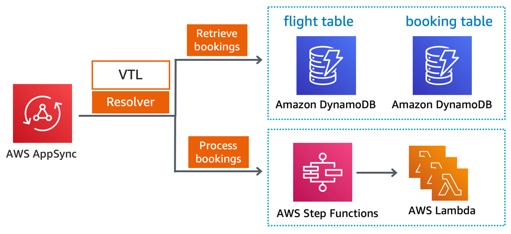
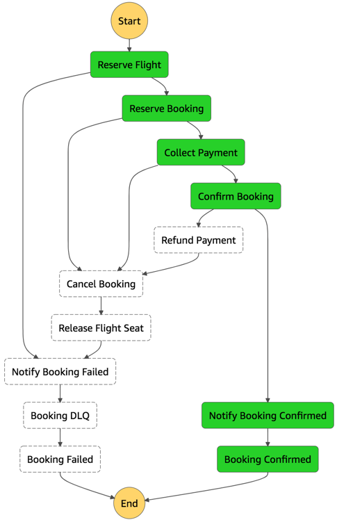
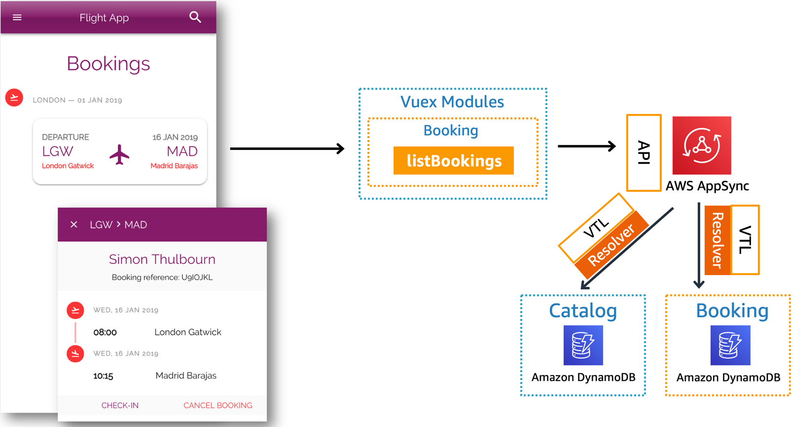

Booking service provides a GraphQL API for reservation, confirmation and cancellation operations.

## Implementation



Booking is comprised of GraphQL API implemented using AppSync, DynamoDB as a database, a booking state machine using Step Functions and Python Lambda functions.

### GraphQL API

Booking API provides create, update, read and list (CRUD) operations on Bookings. It also enforces fine-grained authorization to allow booking owners to read and update their bookings only except Admin users.

#### Configuration

CRUD operations are auto-generated using Amplify off our [API schema](../../../amplify/backend/api/awsserverlessairline/schema.graphql).

Operation | Name | Description
------------------------------------------------- | ---------------------- | --------------------------------------------------------------------
query | getBookingByStatus | Fetches bookings directly from Booking DynamoDB table
mutation | processBooking | Initiates booking state machine in Step Functions

These auto-generated operations are not currently being used and might change with [upcoming improvements](https://github.com/aws-samples/aws-serverless-airline-booking/projects/3). `getBooking`, `listBookings`, `createBooking`, `updateBooking`, `deleteBooking`. 

	
```graphql
type Booking 
    @model(subscriptions: null) 
    @auth(rules: [
      {allow: owner, ownerField: "customer", identityField: "sub", operations: [read, update]},
      {allow: groups, groups: ["Admin"]}
    ])
    @key(name: "ByCustomerStatus", 
        fields: ["customer", "status"],
        queryField: "getBookingByStatus")
{
    id: ID!
    status: BookingStatus!
    outboundFlight: Flight! @connection
    paymentToken: String!
    checkedIn: Boolean
    customer: String
    createdAt: String
    bookingReference: String
}
```

### Booking state machine

Booking state machine handles all operations necessary to create bookings including payment. We use Saga pattern to demonstrate how to implement coordinated transactions, fallback transactions, and dead-letter-queue as part of a state machine.



#### Configuration

Access Logs and Server-side caching are not currently being used to prevent additional charges. When Access Logs is enabled, [you can use CloudWatch Log Insights to search across fully structured logs on all GraphQL API operations](https://aws.amazon.com/blogs/mobile/getting-more-visibility-into-graphql-performance-with-aws-appsync-logs/), including resolver and data statistics. 

The state machine uses a combination of service integration with DynamoDB and SQS and Lambda functions. 

Task | Resource | Description
------------------------------------------------- | ---------------------- | --------------------------------------------------------------------
Reserve Flight | DynamoDB integration | Updates Flight table to conditionally decrease `seatCapacity` field for a given flight
Reserve Booking | Reserve Booking function | Creates a booking as `UNCONFIRMED` in the Booking table
Collect Payment | Collect Payment function | Collects payment from a pre-authorized charge token
Confirm Booking | Confirm Booking function | Confirms booking and set status to `CONFIRMED` in the Booking table
Notify Booking Confirmed | Notify Booking function | Publishes a message to Booking SNS topic

Custom metrics currently emitted to CloudWatch:

Metric | Description | Dimensions
------------------------------------------------- | --------------------------------------------------------------------------------- | -------------------------------------------------
ColdStart | Number of cold start executions | `function_name`, `service`
InvalidBookingRequest | Number of booking transactions that didn't include booking ID | `operation`, `service`
SuccessfulCancellation | Number of successful booking cancellations | `service`
FailedCancellation | Number of booking that failed to be cancelled  | `service`
SuccessfulBooking | Number of bookings confirmed successfully | `service` 
SuccessfulNotification | Number of booking notifications successfully delivered to customers | `service` 
FailedNotification | Number of booking notifications that failed to be delivered to customers | `service` 
SuccessfulReservation | Number of successful booking reservations | `service` 
FailedReservation | Number of bookings that failed to be reserved | `service` 

### Parameter store

`{env}` being a git branch from where deployment originates (e.g. twitch):

Parameter | Description
------------------------------------------------- | ---------------------------------------------------------------------------------
/{env}/service/booking/statemachine/processBooking | Process Booking Step Functions State Machine ARN
/{env}/service/booking/messaging/bookingTopic | SNS Topic ARN for booking operations

## Integrations

### Front-end

Booking provides a [GraphQL Booking data type and a getBookingByStatus query](../../../amplify/backend/api/awsserverlessairline/schema.graphql). Using `@key`, Booking implements a Global Secondary Index (GS) to fetch booking by customer and status using `getBookingByStatus` query as opposed to `listBookings` scan operation.

Flight IDs are stored in Booking table and fetched via `@connection` that effectively queries a separate table (Flight from Catalog) using a GSI.



### Loyalty

See [Loyalty integration section for more information](../loyalty/README.md)

### Payment

See [Payment integration section for more information](../payment/README.md)

## Decisions log

Decision | Description | Timeframe
------------------------------------------------- | --------------------------------------------------------------------------------- | -------------------------------------------------
State Machine for booking process | Primarily to illustrate Saga in practice including handling failed overall executions with a DLQ. This should be simplified after re:Invent 2019, specially booking confirmation. | During Twitch season (Apr-Aug '19)

