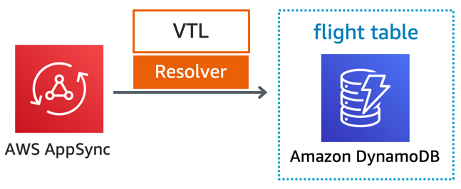
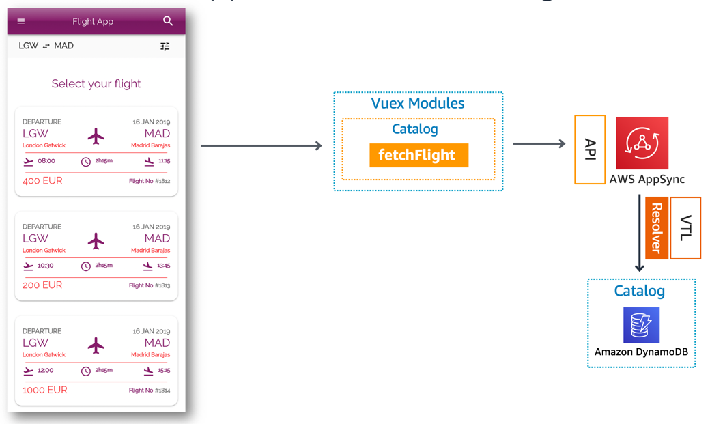

Catalog service provides a GraphQL API for searching flights. 

## Implementation



Catalog is comprised of GraphQL API implemented using AppSync, DynamoDB as a database, and all compute logic runs off Apache Velocity Template (VTL).

### GraphQL API

Catalog API provides a custom query to search for flights on a given schedule. It enforces fine-grained authorization to allow for create, update, read and list (CRUD) operations on flights for Admin and back-end systems such as ETL. 

#### Configuration

CRUD operations are auto-generated using Amplify off our [API schema](../../../amplify/backend/api/awsserverlessairline/schema.graphql).

Operation | Name | Description
------------------------------------------------- | ---------------------- | --------------------------------------------------------------------
query | getFlightBySchedule | Fetches flights directly from Flight DynamoDB table

These auto-generated operations are not currently being used and might change if we implement an Admin view to simulate a travel agency/support center: `getFlight`, `listFlights`, `createFlight`, `updateFlight`, `deleteFlight`.


```graphql
type Flight 
    @model(subscriptions: null)
    @key(name: "ByDepartureSchedule", 
        fields: ["departureAirportCode", "arrivalAirportCode", "departureDate"],
        queryField: "getFlightBySchedule")
{
    id: ID!
    departureDate: String!
    departureAirportCode: String!
    departureAirportName: String!
    departureCity: String!
    departureLocale: String!
    arrivalDate: String!
    arrivalAirportCode: String!
    arrivalAirportName: String!
    arrivalCity: String!
    arrivalLocale: String!
    ticketPrice: Int!
    ticketCurrency: String!
    flightNumber: Int!
    seatAllocation: Int @deprecated(reason: "use seatCapacity instead. seatAllocation will be removed in the stable release.")
    seatCapacity: Int!
}
```

## Integrations

### Front-end

Catalog provides a [GraphQL Flight data type and a getFlightBySchedule query](../../../amplify/backend/api/awsserverlessairline/schema.graphql). Using `@key`, Flight implements a Global Secondary Index (GS) to fetch flights by airports and departure date using `getFlightBySchedule` query as opposed to `listFlights` scan operation.



## Decisions log

Decision | Description | Timeframe
------------------------------------------------- | --------------------------------------------------------------------------------- | -------------------------------------------------
Deprecated `seatAllocation` field | New `seatCapacity` field better express intent while `seatAllocation` would need a seat map when reserving a flight. Both fields are no longer required and use `@deprecated` to demonstrate sunsetting a field. | Shortly after Twitch season (September '19)
