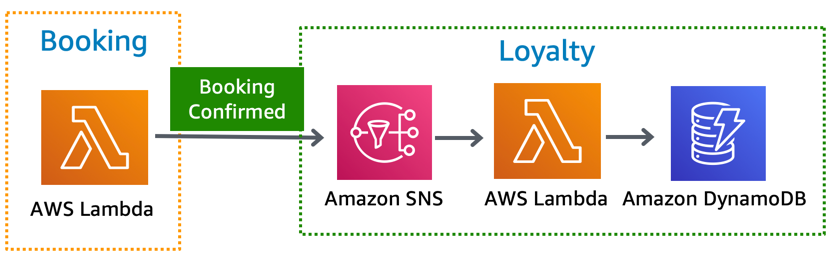

Loyalty service provides a REST API for fetching loyalty points and calculates tier progress.

## Implementation

Loyalty is comprised of a REST API implemented using API Gateway, SNS Topic, Typescript Lambda functions and DynamoDB as a database.

* **Loyalty API** - Provides a single GET resource `/loyalty/{customerId}` and integrates with `Get` function. It enforces `IAM` authorization - See integration for more details on why.
    - **Configuration**: `IAM` as Authorization and inline OpenAPI spec.
    - **Operations**: X-Ray and Throttling are enabled in `Prod` stage.
    - **Metrics**: Detailed metrics enabled.
* **Get function** - Fetches loyalty data from DynamoDB and calculates tier progress.
    - **Configuration**: `TABLE_NAME` as environment variable and Loyalty API as its event source
    - **Operations**: Basic X-Ray instrumentation
    - **Metrics**: None yet
* **Ingest function** - Calculates and ingests loyalty points into DynamoDB
    - **Configuration**: `TABLE_NAME` as environment variable and SNS as its event source
    - **Operations**: Basic X-Ray instrumentation
    - **Metrics**: None yet

## Integrations

### Front-end

Loyalty provides a [GraphQL Loyalty data type and getLoyalty query](../../../amplify/backend/api/awsserverlessairline/schema.graphql). Using SAM, Loyalty implements a custom resolver for `getLoyalty` to authorize and sign requests using sigV4 to Loyalty REST API.

### Booking

Upon a successful booking confirmation, Booking sends booking data to Loyalty SNS topic. SNS invokes Ingest function to calculate points and ingests into DynamoDB.

### Decisions log

Decision | Description | Timeframe
------------------------------------------------- | --------------------------------------------------------------------------------- | -------------------------------------------------
Typescript as an additional language | There weren't many Typescript examples out there for SAM including VSCode step-through debugging. | During Twitch season (Apr-Aug '19)

