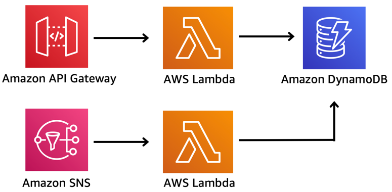
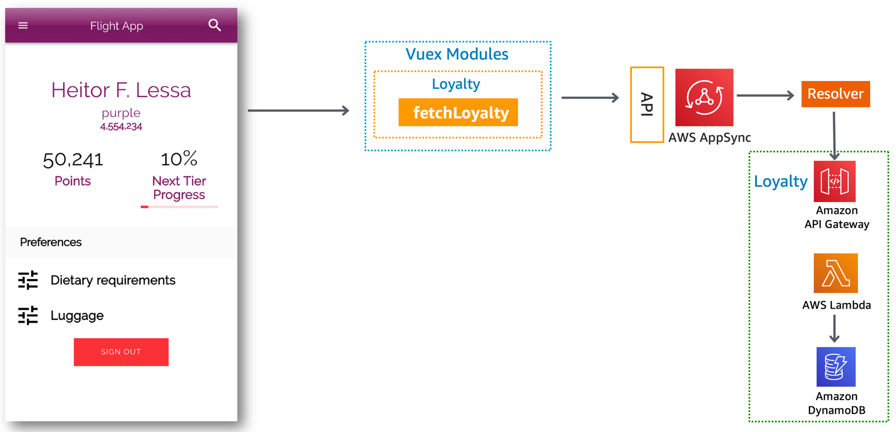

Loyalty service provides a REST API for fetching loyalty points and calculates tier progress.

## Implementation

Loyalty is comprised of a REST API implemented using API Gateway, SNS Topic, Typescript Lambda functions and DynamoDB as a database.

### Loyalty API

Loyalty API provides a read-only API to fetch loyalty points to a given customer. 

#### Configuration

API currently provides the following resources:

Resource | Method | Description
------------------------------------------------- | ---------------------- | --------------------------------------------------------------------
/loyalty/{customerId} | GET | Fetches Loyalty points and next tier progress by invoking `Get` Lambda function.

It enforces `IAM` authorization - See integration for more details on why.

### Get and Ingest functions

`Get` function fetches loyalty data from DynamoDB and calculates tier progress. `Ingest` calculates loyalty points from a confirmed booking. Both use `TABLE_NAME` as environment variable. `Get` function is invoked via API Gateway. `Ingest` function is invoked via SNS topic.

No custom metrics being emitted as of now.

### Parameter store

`{env}` being a git branch from where deployment originates (e.g. twitch):

Parameter | Description
------------------------------------------------- | ---------------------------------------------------------------------------------
/{env}/service/loyalty/api/url" | Loyalty REST API url

## Integrations

### Front-end

Loyalty provides a [GraphQL Loyalty data type and getLoyalty query](../../../amplify/backend/api/awsserverlessairline/schema.graphql). Using SAM, Loyalty implements a custom resolver for `getLoyalty` to authorize and sign requests using sigV4 to Loyalty REST API.

### Booking

Upon a successful booking confirmation, Booking sends booking data to Loyalty SNS topic. SNS invokes Ingest function to calculate points and ingests into DynamoDB.

## Decisions log

Decision | Description | Timeframe
------------------------------------------------- | --------------------------------------------------------------------------------- | -------------------------------------------------
Typescript as an additional language | There weren't many Typescript examples out there for SAM including VSCode step-through debugging. | During Twitch season (Apr-Aug '19)

