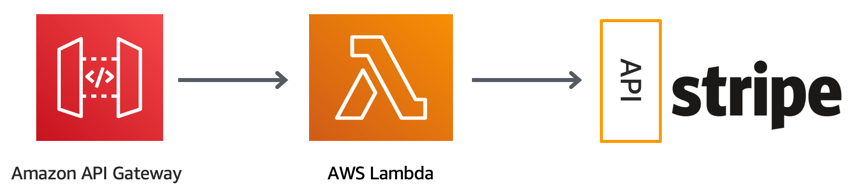
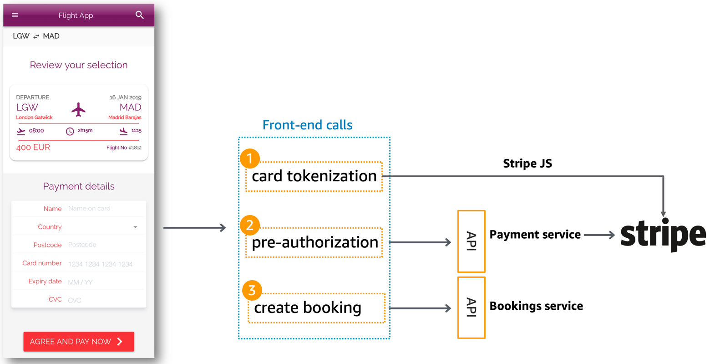

Payment service integrates with Stripe and provides a REST API for pre-authorization, collection and refund operations.

## Implementation

Payment is comprised of a [Serverless Application Repository App named API Lambda Stripe Charge](arn:aws:serverlessrepo:us-east-1:375983427419:applications/api-lambda-stripe-charge) and Python Lambda functions. 

### SAR Lambda Stripe Charge

The SAR App provides a public regional API Gateway endpoint coupled with Lambda functions that integrates with Stripe.

#### Configuration

Lambda Stripe Charge requires a Stripe Secret key to be stored in Parameter Store. We read the environment variable `STRIPE_SECRET_KEY` set in Amplify Console, and as part of the [custom workflow](../../../amplify.yml) we store the value in a parameter named `/{env}/service/payment/stripe/secretKey`.

API currently provides the following resources:

Resource | Method | Description
------------------------------------------------- | ---------------------- | --------------------------------------------------------------------
/charge | POST | Pre-authorize payment by invoking [CreateStripeCharge Lambda function](https://github.com/simalexan/api-lambda-stripe-charge/blob/master/capture.js). It expects a simple JSON blob with `amount`, `currency`, `stripeToken`, `description`, `email` as keys -  See [Stripe specification](https://stripe.com/docs/api/charges/create) for values and response.
/capture | POST | Capture pre-authorized payment by invoking [CaptureStripeCharge Lambda function](https://github.com/simalexan/api-lambda-stripe-charge/blob/master/capture.js). It expects `chargeId` with the previously captured payment token - See [Stripe specification](https://stripe.com/docs/api/charges/capture) for response values.
/refund | POST | Refund existing payment by invoking [CreateRefund Lambda function](https://github.com/simalexan/api-lambda-stripe-charge/blob/master/refund.js). It expects `chargeId` with the previously captured payment token - See [Stripe specification](https://stripe.com/docs/api/refunds/create) for response values.

### Collect and Refund functions

Both functions call our Lambda Stripe Charge API as part of the [Booking](../booking/README.md) business workflow to collect previous pre-authorizations and refund should a booking isn't successful. `PAYMENT_API_URL` environment variable defined SAR App API URL.

Custom metrics currently emitted to CloudWatch:

Metric | Description | Dimensions
------------------------------------------------- | --------------------------------------------------------------------------------- | -------------------------------------------------
ColdStart | Number of cold start executions | `function_name`, `service`
InvalidPaymentRequest | Number of payment transactions that didn't include pre-authorization/authorization charge token | `operation`, `service`
SuccessfulPayment | Number of payments successfully collected from confirmed bookings | `service`
FailedPayment | Number of payments that failed to be collected from confirmed bookings e.g. payment already collected from charge token | `service` 

### Parameter store

`{env}` being a git branch from where deployment originates (e.g. twitch):

Parameter | Description
------------------------------------------------- | ---------------------------------------------------------------------------------
/{env}/service/payment/function/collect | Collect-function ARN
/{env}/service/payment/function/refund | Refund-function ARN
/{env}/service/payment/stripe/secretKey | Stripe Secret Key, created and managed by [Amplify Console Custom workflow](../../../amplify.yml)

## Integrations

### Front-end

Stripe Elements provides card UI and Stripe JS implements card tokenization and validation. Once card is tokenized and validated, the front-end posts the tokenized information to the SAR App API on `/charge`. If successful, it makes a call to [Booking](../booking/README.md) API to starts processing booking details.

### Booking

Process Booking state machine invokes `Collect` and `Refund` function as part of their execution steps. As of now, Step Functions doesn't support HTTP calls hence we need Lambda functions to call our SAR App API.

## Decisions log

Almost as a tech debt record, this help us understand why certain patterns were implemented over others.

Decision | Description | Timeframe
------------------------------------------------- | --------------------------------------------------------------------------------- | -------------------------------------------------
Abstract Stripe implementation | Most customers already have a payment provider and we wanted to replicate that with minimum effort. API Gateway provides a contract for payment operations regardless of the payment provider, and Lambda functions provide additional operations visibility. | During Twitch season (Apr-Aug '19)
