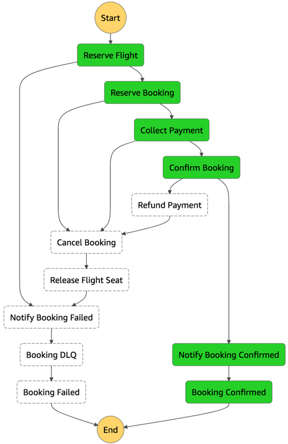

Payment service integrates with Stripe and provides a REST API for pre-authorization, collection and refund operations.

## Implementation

Payment is comprised of a [Serverless Application Repository App named API Lambda Stripe Charge](arn:aws:serverlessrepo:us-east-1:375983427419:applications/api-lambda-stripe-charge) and Python Lambda functions. 

* **API Lambda Stripe Charge** - The SAR App provides a public regional API Gateway endpoint coupled with Lambda functions that integrates with Stripe.
    - **Configuration**: SAR App functions require `/{env}/service/payment/stripe/secretKey` parameter in Parameter Store for Stripe operations
    - **Operations**: X-Ray is enabled in `Prod` stage
    - **Metrics**: None
* **Collect and Refund functions** - These functions call our SAR App API as part of the [Booking](../booking/README.md) business workflow to collect previous pre-authorizations and refund should a booking isn't successful.
    - **Configuration**: Only `PAYMENT_API_URL` environment variable used to call SAR App API.
    - **Operations**: X-Ray, structured logging and custom metrics are implemented via Lambda powertools.
    - **Metrics**: `InvalidPaymentRequest`, `SuccessfulPayment`, `FailedPayment`

Parameters in Parameter Store, where `{env}` is a git branch from where deployment originates:

Parameter | Description
------------------------------------------------- | ---------------------------------------------------------------------------------
/{env}/service/payment/function/collect | Collect-function ARN
/{env}/service/payment/function/refund | Refund-function ARN
/{env}/service/payment/stripe/secretKey | Stripe Secret Key, created and managed by [Amplify Console Custom workflow](../../../amplify.yml)

## Integrations

### Front-end

Stripe Elements provides card UI and Stripe JS implements card tokenization and validation. Once card is tokenized and validated, the front-end posts the tokenized information to the SAR App API on `/charge`. If successful, it makes a call to [Booking](../booking/README.md) API to starts processing booking details.

### Booking

Process Booking state machine invokes `Collect` and `Refund` function as part of their execution steps. As of now, Step Functions doesn't support HTTP calls hence we need Lambda functions to call our SAR App API.

### Decisions log

Almost as a tech debt record, this help us understand why certain patterns were implemented over others.

Decision | Description | Timeframe
------------------------------------------------- | --------------------------------------------------------------------------------- | -------------------------------------------------
Abstract Stripe implementation | Most customers already have a payment provider and we wanted to replicate that with minimum effort. API Gateway provides a contract for payment operations regardless of the payment provider, and Lambda functions provide additional operations visibility. | During Twitch season (Apr-Aug '19)
