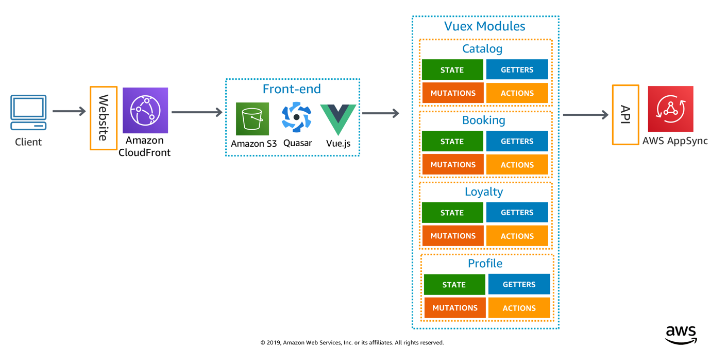

The front-end is built atop Vue.js, and uses Vuex modules to integrate with its back-ends - See [Stack details for completeness](../../README.md#Stack)

## Modules

These are the Vuex modules that manipulate the state, and integrate with each back-end hosted at AWS:

Component | Functionality | Description
------------------------------------------------- | ------------------------------------------------- | ---------------------------------------------------------------------------------
[Catalog](./store/catalog/README.md) | Flight search | Searches for flights given a destination and departure date.
[Booking](./store/booking/README.md) | Bookings | Creates and lists bookings for customers.
[Loyalty](./store/loyalty/README.md) | Loyalty | Fetches Loyalty points for customers including tiers, and calculates how far they are from the next tier.
[Profile](./store/profile/README.md) | Customer profile | Provides authenticated user information to other components such as JWT tokens (user attributes, etc.). It may be extended to create an actual profile service on the back-end.

## Components

We use `component` and `view` terminologies to separate what's a reusable Vue component, and what's a page that need to manipulate state within Vuex.

* **[FlightCard](./components/FlightCard.vue)** - Component to render a flight card when searching or reviewing flight results
* **[FlightLoader](./components/FlightLoader.vue)** - Custom content loader used when searching for flights
* **[FlightToolbar](./components/FlightToolbar.vue)** - Component to filter and sort flight results
* **[BookingCard](./components/BookingCard.vue)** - Component to render modal that provides more details about a booking
* **[BookingFlight](./components/BookingFlight.vue)** - Component to filter and sort flight results

## Views

`Views` map to pages customers interact with, and integrate with their respective modules to fetch and manipulate data from back-ends - [See more details for each view component](./views/README.md)

### Router

We use [Navigation Guards](https://router.vuejs.org/guide/advanced/navigation-guards.html) to enforce authentication for routes that contain `requiresAuth` metadata.

Route | View | Query strings
-------------------------------------- | ------------------------------------------ | ------------------------------------------
/auth | Authentication | None
/, /search | Search | None
/search/results | FlightResults | date, departure, arrival
/search/results/review | FlightSelection | flightId
/profile | Profile | None
/profile/bookings | Bookings | None

## Conventions

We use the following conventions to ease maintenance as we grow the number of modules and services:

* **Actions** - All interactions with back-ends regardless of its communication channel happen within each module's actions.js
* **Mutation** - State isn't mutated directly but through mutations functions (e.g. `SET_BOOKINGS`) and are always uppercase
* **GraphQL** - Custom GraphQL operations have a dedicated file close to its module (e.g. `catalog/graphql.js`)
* **Shared Models** - Data permutation such as formatting flight departure dates differently are done at a class property level e.g. (e.g. `FlightClass`)
* **Code documentation** - We document following JSDoc convention

## Running locally

You can run the front-end locally while targeting the back-end and auth deployed in your AWS account. 

If you followed [the deployment instructions](../../docs/getting_started.md), you should have  `src/frontend/aws-exports.js` file.

Once you're all set, install front-end dependencies and run a local copy:

1. `npm install`
2. `npm run serve`

### I don't have aws-exports, or deleted accidentally

1. Open up your deployed App in Amplify Console by running `amplify console`
2. At the bottom of the page under **Edit your backend**, copy and run the `amplify pull` command
    - e.g. `amplify pull --appId d34s789vnlqyw4 --envName twitch`

> NOTE: **Aws-exports** is a configuration file for AWS Amplify library containing Cognito User Pools, AppSync  API, and what authentication mechanism it should use along with its region.

## Generating code documentation

For more detailed information on methods, constructor, and examples you can generate documentation locally:

1. Run `npm run docs`
2. Open `html/index.html`
