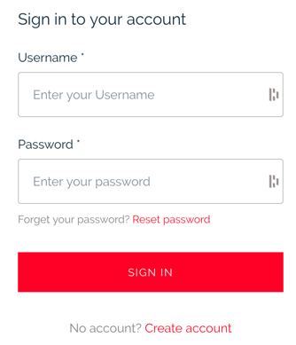
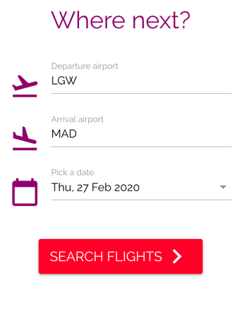
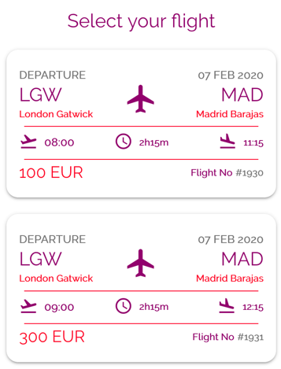
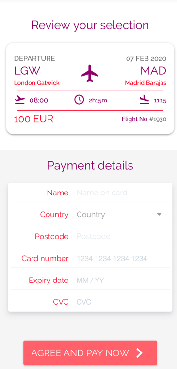
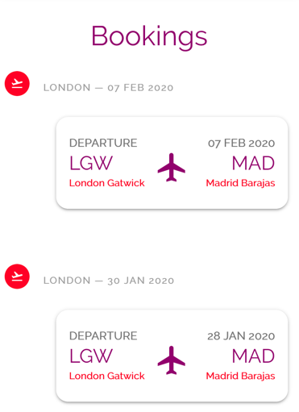
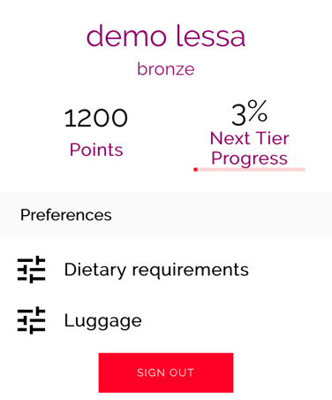

## Authentication

**[Authentication](./views/Authentication.vue)** provides user registration, sign-in, MFA, and password reset via AWS Amplify Authenticator component, and redirect users to the page where they came from.

## Search

**[Search](./views/FlightResults.vue)** collects travel information such as **departure airport**, **arrival airport**, and **departure date**, and sends that information to [Flight Results view](#FlightResults) via query strings - `date`, `departure` and `arrival`.

## FlightResults

**[Flight Results](./views/FlightResults.vue)** uses [catalog](./store/catalog/README.md) module to fetch flights for a given **departure airport**, **arrival airport**, and **departure date**, and render its results using [FlightCard](./components/FlightCard.vue) component.

## FlightSelection

**[Flight Selection](./views/FlightSelection.vue)** uses [booking](./store/booking/README.md) module to pay for a booking reservation using a previously selected flight.

It also uses [catalog](./store/catalog/README.md) module to fetch flights in the event of a page refresh, or direct page access with a flight ID if known.

## Bookings

**[Bookings](./views/Bookings.vue)** uses [booking](./store/booking/README.md) module to fetch bookings for the current authenticated user, and render its results using [BookingFlight](./components/BookingFlight.vue) and [BookingCard](./components/BookingCard.vue) components. 

As of now, it doesn't provide the following functionalities: View past bookings, non-confirmed bookings (cancelled bookings), booking cancellation and flight check-in.

## Profile

**[Profile](./views/Profile.vue)** uses [loyalty](./store/loyalty/README.md) module to fetch loyalty details, and 
[profile](./store/profile/README.md) module to retrieve personal information.

As of now, it doesn't provide customers to set personal preferences such as dietary requirements and luggage.