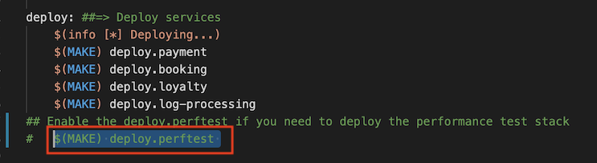
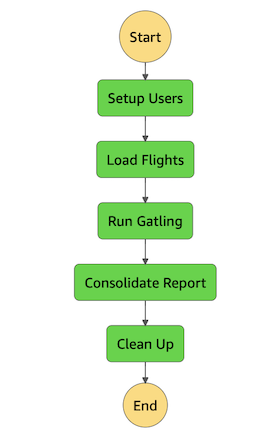
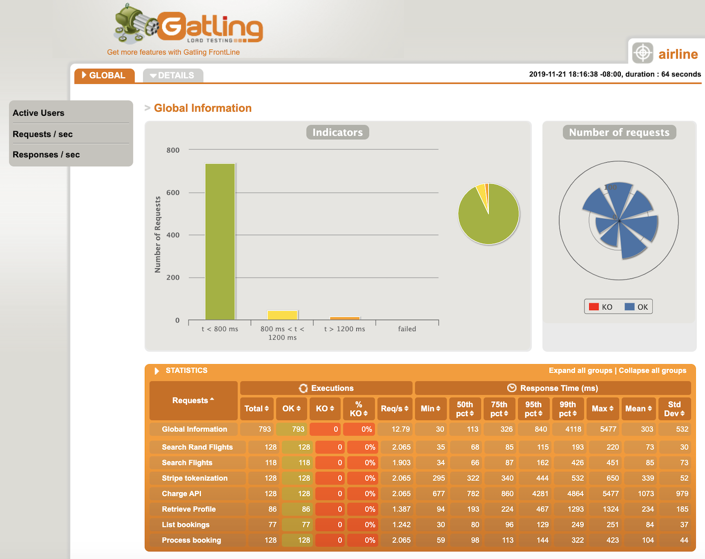

# Overview

The perf-test stack uses [Gatling](https://gatling.io/), open source tool for load testing. The stack creates AWS Stepfunction where each tasks are run as AWS Fargate tasks to execute the setup and Gatling load test simulation. The Gatling simulation script uses constantUsersPerSec and rampUsersPerSec to inject users for the given scenarios. By default, it uses `5 users` for a duration of `300 seconds`(`5 minutes`). These can be overridden via Systems Manager Paramater store.

The scenarios tested are:
- **Random flight search** by injecting 5 users over 5 minutes duration.
- **Retrieve User profile & Loyalty details** for random users. The load pattern ramps up with 1 user to 5 users over the 5 minutes duration.
- **List Booking details** for users. The load pattern ramps up with 1 users to 5 users over the 5 minutes duration.
- **Create new flight booking** by injecting 5 concurrent users over 5 minutes duration.

**Components used:**

<table>
  <tr>
    <th>Folder/File</th>
    <th>Description</th>
  </tr>
  <tr>
    <td rowspan="4">setup | <b>gatling-scripts</b></td>
    <td><b>Queries</b> - This folder contains all the GraphQL queries as input to the Airline.scala gatling simulation script</td>
  </tr>
  <tr>
    <td><b>Airline.scala</b> - Gatling load test simulation script</td>
  </tr>
  <tr>
   <td><b>run-gatling.sh</b> - This is used internally by DockerFile as Entrypoint to download the mock auth tokens for the test users from S3 bucket</td>
  </tr>
  <tr>
            <td><b>logback.xml</b> - Set the level="TRACE" to enable debug tracing</td>
  </tr>
  <tr>
    <td rowspan="3">setup | <b>mock-scripts</b></td>
    <td><b>setup-users.py</b> - The python script creates mock test users in Amazon Cognito Userpool, generates test authentication token and uploads it S3 bucket based on the test users in user.csv</td>
  </tr>
  <tr>
    <td><b>load-flight-data.py</b> - This python script load mock flight data into DynamoDB table</td>
  </tr>
  <tr>
   <td><b>cleanup.py</b> - This python script is run at the end to delete the mock test users from Amazon Cognito userpool, zips Gatling report and uploads it to S3 bucket</td>
  </tr>
  <tr>
    <td><b>bootstrap.sh</b></td>
    <td colspan="2">The bash script use docker-compose to build Gatling and mockdata docker images. All the parameters are passed as ENV variables to the DockerFile.  These environment variables are retrieved from Systems Manager Parameter Store and creates setp.env file. </td>
  </tr>  
  </table>

# Steps:
To deploy the **perf-test** stack, uncomment the `deploy.perftest` in the [MakeFile](./../MakeFile)



After the `perf-test` stack has been deployed successfully, follow these steps:

1. Run `bootstrap.sh` under the **src/perf-tests** folder. This will build the docker images for `gatling-scripts` and `mock-scripts`. 

    ```
    ./bootstrap.sh
    ```

2. After the docker build is complete, lets push the images to Amazon ECR. First login to an Amazon ECR registry
    ```
    aws ecr get-login --no-include-email --region <AWS_REGION>
    ```
    Example:  
    > aws ecr get-login --no-include-email --region eu-west-1

3. Copy paste the docker login command and enter.
    ```
    docker login -u AWS -p <> https://<AWS_ACCOUNT_ID>.dkr.ecr.<AWS_REGION>.amazonaws.com
    ```

4. Tag the docker images and push the latest tagged docker images for `gatling-scripts` and `mock-scripts` to Amazon ECR

    ```
    docker tag gatling:latest <replace_with_YOUR_gatling_ECR_repo_URI>:latest

    docker push <replace_with_YOUR_gatling_ECR_repo_URI>:latest
    ```


    ```
    docker tag mockdata:latest <replace_with_YOUR_mockdata_ECR_repo_URI>:latest

    docker push <replace_with_YOUR_mockdata_ECR_repo_URI>:latest
    ```

## Run load test locally using docker:

1. Creates test users in Amazon Cognito
```
 docker run --env-file=setup.env -it -v ~/.aws:/root/.aws mockdata:latest setup-users.py 
 ```

2.  Creates a few mock flights with arrival and departure details in the DynamoDB table
```
docker run --env-file=setup.env -it -v ~/.aws:/root/.aws mockdata:latest load-flight-data.py
```

3. Start the Airline perf test simulation. Default uses 5 concurrent users for 5 mins. You can override this by updating the setup.env file. The **simulation.log** file will uploaded to the loadtest S3 bucket. You can also run multiple parallel tasks 
```
docker run --env-file=setup.env -it -v ~/.aws:/root/.aws gatling:latest -s Airline -nr -rf /opt/gatling/results/airline
```

4. This step will generate the Gatling report from the simulation.log, uploaded in the previous step. In case of multiple parallel execution of the previous step (Step 3), this setup will parse all the simulation logs and generate a consolidate Gatling report. 
```
docker run --env-file=setup.env -it -v ~/.aws:/root/.aws gatling:latest -ro airline
```

5. This step zips the Gatling report into the loadtest S3 bucket. This step also deletes the mock test users created in Cognito.
```
docker run --env-file=setup.env -it -v ~/.aws:/root/.aws mockdata:latest cleanup.py
```

## Run load test using Step functions:

You can also run the Load test using the load-test StepFunction, which is created as part of the perf-test stack. Ensure the docker images are tagged and pushed to Amazon ECR before starting the StepFunction execution. Start the execution of the `loadtest` Step function using the following input

```
{
  "commands": [
    "./setup-users.py"
  ]
}
```

This will setup users, load mock flight data, start gatling, consolidate the report to **loadtest** S3 bucket

  

## Results:

- Download the results.zip folder from the load-test S3 bucket (refer to the perf-test stack output)
- Open the index.html and you should see a report similar to the below

  

<details>
<summary><strong>Expand you want to run the individual steps manually:</strong></summary><p>

## setup users

aws ecs run-task --cluster CLUSTER_NAME --task-definition TASK_DEFINITION --launch-type "FARGATE" \
--network-configuration "awsvpcConfiguration={subnets=[PROVIDE_SUBNET_IDs],assignPublicIp=ENABLED}" \
--overrides="containerOverrides=[{name=CONTAINER_NAME,command=./setup-users.py}]"

## load flights

aws ecs run-task --cluster CLUSTER_NAME --task-definition TASK_DEFINITION --launch-type "FARGATE" \
--network-configuration "awsvpcConfiguration={subnets=[PROVIDE_SUBNET_IDs],assignPublicIp=ENABLED}" \
--overrides="containerOverrides=[{name=CONTAINER_NAME,command=./load-flight-data.py}]"

## start airline test

aws ecs run-task --cluster CLUSTER_NAME --task-definition TASK_DEFINITION --launch-type "FARGATE" \
--network-configuration "awsvpcConfiguration={subnets=[PROVIDE_SUBNET_IDs],assignPublicIp=ENABLED}" \
--overrides="containerOverrides=[{name=CONTAINER_NAME,command=-s Airline -nr -rf /opt/gatling/results/airline}]" --count 1

## consolidate report

aws ecs run-task --cluster CLUSTER_NAME --task-definition TASK_DEFINITION --launch-type "FARGATE" \
--network-configuration "awsvpcConfiguration={subnets=[PROVIDE_SUBNET_IDs],assignPublicIp=ENABLED}" \
--overrides="containerOverrides=[{name=CONTAINER_NAME,command=-ro airline}]"

## cleanup
aws ecs run-task --cluster CLUSTER_NAME --task-definition TASK_DEFINITION --launch-type "FARGATE" \
--network-configuration "awsvpcConfiguration={subnets=[PROVIDE_SUBNET_IDs],assignPublicIp=ENABLED}" \
--overrides="containerOverrides=[{name=CONTAINER_NAME,command=./cleanup.py}]"

  </p></details>