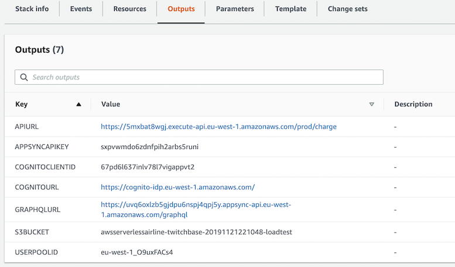

# Overview

This perf-test stack uses [Gatling](https://gatling.io/), open source tool for load testing. The stack creates AWS Fargate Cluster to run the setup and Gatling scripts.

The setup scripts found under [mock-scripts](./mock-scripts) folder
- creates test users in Amazon Cognito userpool
- load mock flight data into Flights table
- zips Gatling reports and upload to S3 bucket

The Gatling simulation script uses constantUsersPerSec and rampUsersPerSec to inject users for the given scenarios. By default, it uses `5 users` for a duration of `300 seconds` OR `5 minutes`. These can be updated in the Docker file. 

All these steps are co-ordinated using AWS Step functions.

# Steps
After the perf-test stack has been deployed successfully, 

1. Update the following ENV variables in the Dockerfile (both under `gatling-scripts` and `mock-scripts` folders) using the outputs from perf-test stack

    ```
    ENV COGNITO_CLIENT_ID <client_id>
    ENV COGNITO_URL https://cognito-idp.<region>.amazonaws.com/ 
    ENV GRAPHQL_URL <appsync_url>
    ENV API_URL <payment_api_url>
    ENV TOKEN_CSV user-with-token.csv
    ENV AWS_REGION <region>
    ENV S3_BUCKET <load-test-bucketname>
    ENV USER_COUNT 2
    ENV DURING_TIME 60
    ENV USER_CSV user.csv
    ENV FOLDERPATH ./
    ENV USER_POOL_ID <cognito_pool_id>
    ENV APPSYNC_API_KEY <appsync_api_key>
    ```

    

2. After the environment variables in the DockerFile is updated, we need to push them to Amazon ECR. First login to an Amazon ECR registry
    ```
    aws ecr get-login --no-include-email --region <AWS_REGION>
    ```

3. Copy paste the docker login command and enter.
    ```
    docker login -u AWS -p <> https://<AWS_ACCOUNT_ID>.dkr.ecr.<AWS_REGION>.amazonaws.com
    ```

4. Build docker

    ```
    cd gatling-scripts

    docker build -t gatling:latest . 

    docker tag gatling:latest <replace_with_YOUR_gatling_ECR_repo_URI>:latest

    docker push <replace_with_YOUR_gatling_ECR_repo_URI>:latest
    ```

repeat this for the mock-scripts

    ```
    cd mock-scripts

    docker build -t mockdata:latest . 

    docker tag mockdata:latest <replace_with_YOUR_mockdata_ECR_repo_URI>:latest

    docker push <replace_with_YOUR_mockdata_ECR_repo_URI>:latest
    ```

## Run load test locally using docker:

1. docker run -it -v ~/.aws:/root/.aws mockdata:latest setup-users.py 
2. docker run -it -v ~/.aws:/root/.aws mockdata:latest load-flight-data.py
3. docker run -it -v ~/.aws:/root/.aws gatling:latest -s Airline -nr -rf /opt/gatling/results/airline
4. docker run -it -v ~/.aws:/root/.aws gatling:latest -ro airline
5. docker run -it -v ~/.aws:/root/.aws mockdata:latest cleanup.py

## Run load test on AWS:

Execute the `start-load-test` Step function using the following input

```
{
  "commands": [
    "./setup-users.py"
  ]
}
```

This will setup users, load mock flight data, start gatling, consolidate the report to S3 bucket

In case you want to run the individual steps manually:

## setup users

aws ecs run-task --cluster CLUSTER_NAME --task-definition TASK_DEFINITION --launch-type "FARGATE" \
--network-configuration "awsvpcConfiguration={subnets=[PROVIDE_SUBNET_IDs],assignPublicIp=ENABLED}" \
--overrides="containerOverrides=[{name=CONTAINER_NAME,command=./setup-users.py}]"

## load flights

aws ecs run-task --cluster CLUSTER_NAME --task-definition TASK_DEFINITION --launch-type "FARGATE" \
--network-configuration "awsvpcConfiguration={subnets=[PROVIDE_SUBNET_IDs],assignPublicIp=ENABLED}" \
--overrides="containerOverrides=[{name=CONTAINER_NAME,command=./load-flight-data.py}]"

## start airline test

aws ecs run-task --cluster CLUSTER_NAME --task-definition TASK_DEFINITION --launch-type "FARGATE" \
--network-configuration "awsvpcConfiguration={subnets=[PROVIDE_SUBNET_IDs],assignPublicIp=ENABLED}" \
--overrides="containerOverrides=[{name=CONTAINER_NAME,command=-s Airline -nr -rf /opt/gatling/results/airline}]" --count 1

## consolidate report

aws ecs run-task --cluster CLUSTER_NAME --task-definition TASK_DEFINITION --launch-type "FARGATE" \
--network-configuration "awsvpcConfiguration={subnets=[PROVIDE_SUBNET_IDs],assignPublicIp=ENABLED}" \
--overrides="containerOverrides=[{name=CONTAINER_NAME,command=-ro airline}]"

## cleanup
aws ecs run-task --cluster CLUSTER_NAME --task-definition TASK_DEFINITION --launch-type "FARGATE" \
--network-configuration "awsvpcConfiguration={subnets=[PROVIDE_SUBNET_IDs],assignPublicIp=ENABLED}" \
--overrides="containerOverrides=[{name=CONTAINER_NAME,command=./cleanup.py}]"

## Results:

- Download the results.zip folder from the S3 bucket (refer to the perf-test stack output)
- Open the index.html and you should see a report similar to the below

  